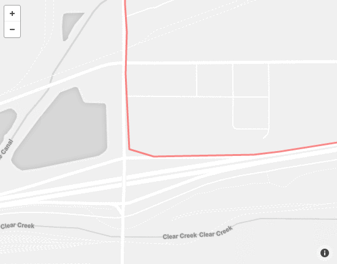
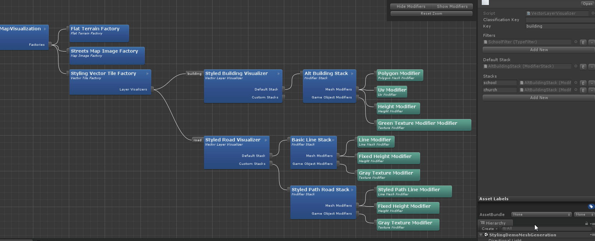

## CHANGELOG
### v.2.0.1
#### Bug Fixes
- Fixes a bug where tiled uv calculation for in height modifier was wrong and stretching instead of tiling

### v.2.0.0
10/15/2018
##### New Features
- *Runtime editing of map features* - Map elements like Imagery, Terrain, Feature Properties can now be updated during runtime, using AbstractMap UI in the Editor , or by using the API methods.
- *Map API’s* - Maps SDK for Unity now has API methods to build and edit maps entirely using scripts.
##### Improvements
- Improves fallback for terrain tiles with missing or no data. Image will be now rendered on flat tiles instead of blank tiles.
- Improves terrain height query by using local position/rotation/scale of a tile. Use `QueryElevationInUnityUnitsAt` or `QueryElevationInMetersAt` API methods to query height.
- Terrain module “Sample Count” property changed to a slider.
- Improves tile loading and recycling performance.
##### Bug Fixes
- Fixes issue where Terrain was not turned off with `None` option.
- Fixes issue where Node Editor script was throwing a compilation error due to deprecated API in Unity 2018.2
- Fixes issue where SnapToZero moved the map for each new tile loaded instead of only using the first one.
- Fixes issue with the height modifier where floor height calculations were wrong causing overlapping floors.
- Fixes issue where dispose buffer setting was being ignored by `RangeAroundTransform` extent type.
- Fixes builds for UWP/ Hololens environments.
- Fixes issue where ARTableTop map would not snap to the detected plane on zooming in/out.
- Fixes issue where `BuildingsWithUniqueIds`  setting was getting applied incorrectly, resulting in missing buildings.

##### Breaking Changes
- Any `Feature` layers under `Map Layers` using a `Custom` style type will need to be re-assigned through the AbstractMap UI. This change was necessary to persist custom style options when switching between different styles.

### v.1.4.5
08/20/2018
##### New Features
- Added a **ReplaceFeatureCollectionModifier** class that allows multiple ReplaceFeatureModifiers to be run from one modifier.
- Added seven hero structures - Transamerica Pyramid, Coit Tower, Salesforce Tower, Empire State Building, Chrysler Building, One World Trade Center, Statue of Liberty.
##### Improvements
- Added color option to texturing style
- Added color palettes drop down to Simple texturing option. Allows users to choose between different color palettes.
- Improvements to Tile states and map states. Map extent finished state is robust and deterministic.
- Removed dependency of Tile Providers on Update methods.

### v.1.4.4
*07/10/2018*
##### New Features
- Selecting `Simple` Texturing Style in a `Vector Layer Visualizer` exposes a drop down menu which allows users to select a color palette for that layer.
##### Improvements
- Added 2 examples to the setup dialog
- AstronautGame - enhanced version of the Location Based game with custom styling and Astronaut asset
- TrafficAndDirections - example built around using Mapbox's traffic data layer and directions API
- Fix an issue with factories where a racing condition causing tiles without imagery
- Fixes the issue with Replacement Modifier to prevent duplicate prefab spawning and blocking wrong features.
- Fixes the issue with custom styles that go missing after building to a device.
- Fix an issue with factories where a racing condition causing tiles without imagery
- Added a separate Traffic and Directions demo scene
- Changed loft modifier to stretch texture horizontally
- Changed Directions Factory to check waypoints on timer and recalculate path if there's a chance

### v.1.4.3
*06/18/2018*
##### New Features
- Added a **Feature Replacement Modifer** that allows replacement of a vector feature at a given Latitude,Longitude with a supplied prefab. Enables replacing a procedurally generated building at a given Latitude,Longitude with a custom 3D model.
- Texturing Style dropdown now allows users to select from prepackaged texture styles or custom, which allows for user-defined texturing.
- Mesh and GameObject modifiers can now be created and added to AbstractMap via `Add New` buttons.
- Example scene `LocationProvider` can be used to log GPS traces. See documentation on how to copy logs from devices.
- GPS traces can be played back in the Editor with `EditorLocationProviderLocationLog`.
- `UserHeading` and `DeviceOrientation` values can be smoothed via different smoothing algorithms.
##### Improvements
- Improvements to UV mapping for side walls of extruded polygons when using atlas textures. Enables better handling of leftover areas when creating columns.
- DeviceLocationProvider should work on devices. Tested with iPhone 7/8/X, Google Pixel 2, Samsung S8, Samsung Galaxy Note 8, OnePlus 3
##### Bug Fixes
- Fix issue with UvModifier which caused wrong roof uv positions calculations.
- Fix issue with data fetcher to handle failed connections properly, which caused IndexOutOfRangeException during tile loading/unloading.
- Fix issue with ambient file caching on Windows with .NET4.6 runtime and long file names. https://github.com/mapbox/mapbox-unity-sdk/pull/825 https://github.com/mapbox/mapbox-unity-sdk/issues/815
##### Known Issues
- ARInterface related errors and crashes on Unity 2018.1.1f1 related to bug in Unity  https://issuetracker.unity3d.com/issues/vuforia-gameobject-transforms-are-not-being-disabled-when-the-player-is-stopped

 ### v.1.4.2
*05/14/2018*

##### New Features
- Layer names and property names are preloaded from the data source into a dropdown.
- Add `Location Prefabs` section to `AbstractMap`. Enables users to spawn prefabs at points-of-interest on the map directly from the `AbstractMap` UI.
- Add options to spawn prefabs on points-of-interest using `Mapbox Category`, `Name`, or a list of `Address or LatLon`.
- Add methods on `AbstractMap` to spawn prefabs. Enables users to add layers via script.
- Add the `LocationPrefabs.unity` example scene. Demonstrates the basics of using the `Location Prefabs` feature.
- Add `OnUpdated` event to `AbstractMap`. Enables subscribers to get a notification when the map location and/or zoom gets updated.
- `DeviceLocationProviderAndroidNative`: a native location provider for Android that directly accesses location and orientation provided by the operating system not using Unity's `Input.location` which has some shortcomings, eg coordinates truncated to `float` precision.
  **Only available on Android 7.0 (Nougat, API Level 24) and up!**
- `EditorGpsLogLocationProvider`: an Editor location provider to replay real world GPS traces logged with [GNSSLogger](https://github.com/google/gps-measurement-tools/tree/master/GNSSLogger)
- New example scene showing `UserHeading` and `DeviceOrientation`

##### Improvements
- `UnityARInterface` updated to [commit 67351b6](https://github.com/Unity-Technologies/experimental-ARInterface/commit/67351b66ff9af28380e7dd5f5b2f4ba1bf802ca8) from March 1st 2018
- Additional properties on `RotateWithLocationProvider` to account for new `Location` properties `UserHeading` and `DeviceOrientation`.
- Changes to terrain factory (#623)
  - Create a new base class
  - Introduce all different terrains as strategies
  - Change sidewalls as a property on elevated terrain strategy
- Data Fetching Changes (#622)
  - Move data calls from factories to DataFetcher classes
  - Factories register to events in DataFetchers
-  `Layer Name` , `Extrusion Property Name` and `Filter Key` are now selectable dropdowns indicating the layers and properties available in the current `Data Source`. Layers and properties no longer require manual string entry.

##### Bug Fixes
- Added checks to prevent NRE in `GeocodeAttributeSearchWindow` when searching with an invalid token or no connection.
- Fix issue where side wall mesh generation did not work with elevated terrain.
- Fix issue with scaling prefabs for POI's. Enables correct scaling of objects with map.

##### Known Issues
- `Filters` with empty key or value parameters will exclude all features in a layer.
-  SDK will throw `[Physics.PhysX] cleaning the mesh failed` error if a MapFeature is used with the following options: {Primitive Type: `Line`, LayerName: `Road`, Collider Type: `Mesh Collider`}

##### BREAKING CHANGES
- Property `Heading` on `Location` object has been split into `UserHeading` and `DeviceOrientation`.
  - `UserHeading`: the direction the user is moving. This is calculated from the latest position. If the user stops moving the last heading value is kept.
  - `DeviceOrientation`: value obtained from the device compass. Where the device is looking to.

### v.1.4.1
*04/17/2018*

##### New Features
- Add two new modules, KdTreeCollection and AddToCollection Gameobject modifier.
- Add Collider option for vector features.
- Add scale factor for extrusion value derived from feature property.
- Add camera script with zoom & pan support for TabletopAR scene.

##### Bug Fixes
- Remove `buildingsWithUniqueIds` setting for `Mapbox Streets` data source.
- Change `Style Name` to `Data Source`
- Fix to make filter values case insensitive.
- Fix issue where position vector features was not being set.
- Fix `Range Property` extrusion option for vector features.
- Select newly created layer visualizer.
- Fix typo in colorPalette.
- Add defaults for all sublayer properties to not carry over any options from the previous layer.
- Don't allow empty names for layer visualizers.
- Fix foldouts not retaining states between play mode & editor.
- Add missing tooltips.
- Fix issue with Satellite TextureType.
- Added a check to prevent NRE on tile update because map was not initialized.
- Added method to disable `InitializeOnStart` in the `Initialize With Location Provider` script.
- Fix loop counter in `SpawnInsidePrefabModifier` which was causing an infinite loop.

### v.1.4.0
*03/20/2018*

#####
- Drag and drop prefabs for most common use cases.
- New Abstract Map UI
- Style development - colorization and atlas template generator
- Use texture atlas for building geometries.
- Merge buildings with unique ids using the experimental 3D buildings tileset.
- Added a API call on AbstractMap to query height at a certain latitude longitude.
- Included EditorConfig file to enforce coding style
- Integration of previously seperate AR support https://github.com/mapbox/mapbox-unity-sdk/pull/544

### v.1.3.0
*12/18/2017*

##### Upgrade Instructions
- As always, if you already have a project with a previous version of the SDK, please remove older versions before installing this new one!
- `FeatureBehaviour` is no longer added to feature gameobjects by default. Use a `FeatureBehaviourModifier` to add this component (optimization).
- `TextureModifier` is obsolete. Please use `MaterialModifier`.
- `LocationProvider` has been heavily modified to support additional features. Please update you references accordingly.
- `MeshFactory` and `PoiVisualizer` have been deprecated (previously obsolete).

##### Memory/Performance Upgrades
- Added ability to use coroutines inside `VectorLayerVisualizer`—this option will help prevent locking main thread during tile creation. Note that this will normally result in longer map load times, however.
- Objects generated from vector tiles (meshes, game objects, colliders, renderers, etc.) are now pooled and re-used accordingly. This expedites feature creation and helps prevent memory fragmentation.
- Fixed some memory leaks.
- General performance improvements—maps should now load much faster, in general.

##### New Features
- Added convenience methods to `AbstractMap`  to convert between Lat/Lon ↔ Vector3. This also works for maps that have been translated, rotated, or scaled! #387
- Added tile error exception events that you can hook into to know when specific tiles fail to load. We provide an example `TileErrorHandler` object that logs these to console.
- Added C# wrapper for Mapbox Token API (to validate tokens).
- Added transparency shader for raster tiles—this enables you to convert black to alpha from Mapbox studio styles (to render just road labels, for example).
- Added new `LoftModifier`—use this to make complex geometry from line features.
- Added prefabs for location provider and “player” avatar for convenience. #382
- Added Mapbox Map Matching API #302

##### Bug Fixes
- It should now be safe to nest the Mapbox folder (SDK) in your own projects.
- You can now properly change/load scenes at runtime. #381
- Fixed token validation issues (validate token when initializing `MapboxAccess`). #430
- Custom inspectors now properly serialize assets assigned via built-in object browser.
- Fix for certain tile providers not updating properly when re-initializing a map.
- Fixed issue where clipped features would result in several new features. #398
- Fixed one potential race condition with `DeviceLocationProvider` on iOS devices, where location would not properly send locations as expected.
- `Conversions.cs` are now properly supported in zoomable map implementations.
- Fixed bug where certain tile providers would give out of sync exception.
- Fixed `duplicate keys` exception related to some slippy maps.
- Fixed bugs related to snap modifiers not working properly depending on `feature position` of the stack.
- Removed duplicate event registration in `MapVisualizer`.
- Fixed bugs associated with `Filters` and string comparisons in `VectorLayerVisualizer`.

##### Improvements
- Made several methods virtual to better support extension.
- Improvements to map editor. #343
  - Map editor will refresh automatically when window receives focus.
  - VectorTileFactory now has checkboxes to toggle specific layer visualizers.
-  Use `InitializeMapWithLocationProvider` to initialize a map at a specific location (device location), but don’t forget to disable `InitializeOnStart` on your map object!
- LocationProvider has been abstracted for easier serialization/assignment in the Unity editor.
- LocationProvider now supports sending additional data with `Location` object.
- It is now easier to mock locations in the editor.
  - Array support to mock a specific route (`LocationArrayEditorLocationProvider`).
  - Transform support on `EditorLocationProvider` to create simple offsets.
  - Use Unity Remote app to send location updates directly to the Unity editor from your device!
- `DynamicZoom` example has been improved, see new `Zoomable` map example.
- Added string to lat/lon conversion method.
- Various nodes in the map factory framework now have public fields to support run-time styling or modification before map generation (based on settings, for example).
- Maps now support float values for zoom level—you can use this to inform camera controllers, for example.
- Added UnityTile getter to AbstractMapVisualizer. This enables `UnityTile` lookup at runtime. #382

##### Examples
- Optimized and consolidated examples.
  - Removed `Drive` example.
  - Removed `DynamicZoom` example (replaced with `ZoomableMap`).
  - Removed `LowPoly`.
  - Removed `MapReload` (many examples now support this functionality).
  - Removed `SlippyTerrain` example (see `ZoomableMap` for similar and improved functionality).
  - Removed `TerracedWorld`.
  - Added `Explorer` example—vector map example covering a variety of layers and features.
  - Added `ZoomableMap` example.
  - Combined MeshGeneration Examples into BasicVectorMap folder.
- See here for the latest.

##### Known Issues
- `ZoomableMap` does not constrain map position to camera bounds. At some zoom levels, the map will go above the camera.
- iOS/Unity 2017.1+ sometimes location updates are delayed or not sent properly. We suspect this is an iOS/Unity issue.
- If you have issues with missing libraries in Xcode, please check that you are not using `symlink` in your Unity build settings and that your min. target OS is 8.
- Requesting too many tiles at once (on client) will often lead to many failed tile requests. We recommend that you distribute these requests over many frames!

### v.1.2.0

*09/26/2017*

*Please note: this release marks the beginning of official support for the Unity 2017 lifecycle.*

##### Upgrade Instructions
- As always, please remove older versions before installing!
- `AbstractMap` has officially been abstracted! This means that you must substitute, in your own scenes, a concrete implementation. We offer `BasicMap`, `MapAtSpecificLocation` and `DynamicZoomMap`.
- MapVisualizer has also been abstracted for tile placement purposes. You may need to point your existing maps to the new concrete implementation (`MapVisualizer`) and re-serialize your references (`Factories`).

##### Memory/Performance
- General performance optimizations.

##### New Features
- `DynamicZoomMap`, `DynamicMapVisualizer` and `DynamicZoomTileProvider` demonstrate how to build web-like maps that can pan and zoom smoothly.
- You can now convert latitude/longitude to a position on the sphere (see `Conversions.cs` and the `Globe` example).
- Use the new `MapAtSpecificLocation` component to create a map that is centered precisely at a given location.
- Use the new `RangeAroundTransformTileProvider` component to procedurally load tiles as a transform changes. This is useful for loading map content as a player avatar moves based on physical location. Check the `LocationProvider` example for more information.
- Map Editor (Mapbox --> Map Editor)
  - Allows navigation of any Map Factory Frameworks referenced in the current scene
  - Selecting a node will select the corresponding asset for manipulation in the inspector
  - Added new asset browsing capabilities to these nodes (factories, modifiers, etc.)

##### Bug Fixes
- We now catch exceptions when parsing Android library file names (duplicate library check).
- Fixed some wrong `Conversions` values and methods that would lead to improper positioning or gaps between tiles.
- The Mapbox configuration window no longer gets stuck validating a token.
- Wolfulus line ending fixer issues in Unity 2017 have been resolved.
- Fixed broken `VectorTileExample`.
- `AbstractMapVisualizer` state change events no longer fire improperly when loading tiles from cache.
- Tiles should no longer appear all white or all black when using very small `UnityTileSize`.
- `Map.cs` no longer executes the notify callback twice.

##### Improvements
- Maps can now be `Initialized` with a latitude/longitude and a zoom level, at any time!
	- This means that you can re-use a map for a new location or zoom.
- Scaling is now performed at a vertex level, which helps prevent floating-point imprecision and leads to a cleaner hierarchy.
- `Vector2d` is now  serializable (for inspector purposes).
- `MapId` and `Factories` are now public so that you can change them at runtime.

##### New Examples
- [See here for the latest.](https://www.mapbox.com/unity-sdk)

### v.1.1.0

*08/01/2017*

*Please note: our next release will end support for the Unity 5.x lifecycle. We look forward to taking advantage of Unity 2017 optimizations and features.*

##### Upgrade Instructions
- As always, please remove older versions before installing!
- `TypeFilter` now uses an array. You will need to update your filters!
- `MeshFactory` is obsolete. Please replace with `VectorTileFactory` or `StyleOptimizedVectorTileFactory`.
- `PoiVisualizer` is obsolete. Please use a standard `VectorLayerVisualizer` with a `PrefabModifier`.
- Triangle.NET has been replaced with `Earcut`. If you were using Triangle features, you will need to [import that library yourself](https://github.com/mapbox/triangle.net-uwp).
- If you were using a `RangeTileProvider`, you will need to update its parameters, which are now described in terms of North, East, South, and West (for readability).
- `ChamferModifier` has been replaced with `ChamferHeightModifier`. This new version looks and performs better.
- Ensure your `MapImageFactories` have the expected `Map Id`! We've updated the way Ids are serialized, and your old Ids may have been lost--sorry!

##### Memory/Performance
- Added support for style-optimized vector tiles! [Read more here.](https://www.mapbox.com/api-documentation/#retrieve-tiles)
    - You will need to use the new `StyleOptimizedVectorTileFactory`.
    - This can result in far less data transfer/data processing.
- Replaced Triangle.NET with `Earcut` which results if much faster geometry construction.
- Removed expensive string concatenation process in `FeatureBehaviour`.
- `MeshFactory` no longer waits for `Terrain` or `Raster` results before making its own web request.

##### New Features
- Added ability to cache successful tile requests to disk (via SQL database). If a tile is found in the database, it will not make a web request.
    - Note that tiles in this database only expire when the cache fills up!
- Want to create a low-poly landscape? Use the new `LowPolyTerrainFactory`!
- Maps can now be snapped to `y=0` (this prevents the need to reposition your camera at higher elevations).
- Added ability to choose pivot of objects generated with the `ModifierStack` (tile center, first vertex, or vertex average).
- Use the new `GameObjectModifier` `AddMonoBehavioursModifier` to "generically" add `Components` to your game objects.
- Added ability to snap to terrain/other objects with `SnapTerrainRaycastModifier`. This is more accurate (but slower) than `SnapTerrainModifier`.
- Added "example" `SpawnInsideModifier` which can be used to add procedural decoration inside a mesh (for example, `Landuse`).
- Added `ChamferHeightModifier` which, obviously, combines `Chamfer` and `Height` modifiers.
- Added `GlobeTileProvider` to request the entire world at once (be advised that this may result in MANY tile requests!).
- Project your tiles on a sphere! Use the new `GlobeTerrainFactory` to make a globe.
- Added ability to pick a custom style from the Mapbox Styles API.
    - Use the search button and enter your user name (for Mapbox Studio).
    - Note that this requires you to [create an API token](https://www.mapbox.com/studio/account/tokens/) that supports `styles:list`!

##### Bug Fixes
- WebGL builds now work as expected!
- Fixed Unity Cloud Build and iOS signing issues that were related to native iOS libraries.
- Map tiles are now parented correctly to the map root (on device). If you previously had trouble rotating/moving/scaling a map on device, fret no longer!
- Fixed some bad height calculations for buildings.
- `PolygonModifier` now correctly generates holes and better handles multiple `parts`.
- Tiles should now wrap at world boundaries correctly (rather than producing invalid tile requests).

##### Improvements
- Unity/C# warnings have been addressed.
- Added preprocess build step and a unit test that checks for duplicate Android libraries.
- Example `CameraMovement` script has been improved to allow for mouse wheel translational zoom and precise touch drag (for panning).
- Added option to remove sidewalls from height-extruded geometry (for roads, for example).
- Use `VertexDebugger` to debug vertices for procedurally generated meshes.
- Added timeout exception to `HttpRequest`.
- RangeTileProvider is now more readable.

##### New Examples
- See `Globe` example for one method of spherically projecting tiles.
- `MeshGenerationBasics` has new interactive elements to demonstrate some of the new features we've added.
- `StylingDemoMeshGeneration` uses `SpawnInsideModifier` to add "bushes" to `landuse:park`.
- Check `TerracedWorld` to see an example of how to use contour data to generate Godus-like worlds.

### v.1.0.0

*05/26/2017*

##### Memory/Performance

- Added support for runtime texture compression (DXT) in the `MapImageFactory`
- `MapVisualizer` now pools gameobjects/textures/data to avoid instantiation and destruction costs
- TerrainFactory now allocates less memory when manipulating geometry
- Elevation textures are no longer held in memory and height data parsing and access is much faster
- Added new `FlatTerrainFactory` that is optimized specifically for flat maps
- Tiles can now be cached in memory—configure the cache size in `MapboxAccess.cs` (default size is 500)
- Slippy maps now dispose tiles that determined to be "out of range"
  - Tiles that are out of range before completion are properly cancelled
- Terrain generation in Unity 5.5+ should be much faster and allocate less memory

##### New Features

- Added new retina-resolution raster tiles
- Added mipmap, compression, and retina-resolution support to `MapImageFactory`
- The `PoiGeneration` example now includes clickable 3D world-space gameobjects—use these as reference for placing objects in Unity space according to a latitude/longitude
- `MapVisualizer` and `TileFactories` now invoke state change events—use these to know when a map or specific factory is completed (loaded)

  - See an example of implementing a loading screen in `Drive.unity`
- You can now specify GameObject `Layer` for tiles in the `TerrainFactory`
- Add colliders to your terrain by checking the `Add Collider` flag in the `TerrainFactory`
- Add colliders or specify GameObject `Layer` for buildings, roads, etc. with `ColliderModifier` and `LayerModifier`

##### Bug Fixes

- Building snapped to terrain are now rendered correctly (check `Flat Tops` in the `HeightModifier`)
- Web request exceptions are now properly forwarded to the `Response` (should fix `Unknown tile tag: 15`)
- Complex building geometry should now be rendered correctly (holes, floating parts, etc.)
- Materials assigned to a `TerrainFactory` are now properly applied at runtime
- Because of `UnityTile` pooling, you should no longer encounter `key already exists in dictionary` exceptions related to tile factories—this means you can change map attributes (location, zoom, terrain, etc.) at runtime without throwing exceptions

##### Improvements

- Map configuration values are no longer static, and an `OnInitialized` event is invoked when the `AbstractMap` reference values have been computed (prevents temporal coupling)
- Snapping to terrain has been simplified—just add a `SnapToTerrainModifier` to your `ModifierStack`
- `Slippy.cs` has been refactored to `CameraBoundsTileProvider.cs` and the backing abstraction enables you to write your own tile provider system (zoomable, path-based, region, etc.)
- `MapController.cs` has been refactored to `AbstractMap` —this is not yet abstract, but should provide an example of how to construct a map using a `MapVisualizer` and a `TileProvider`
- `UnityTile` has been refactored to support reuse and has the ability to cancel its backing web requests
- `DirectionsFactory` no longer relies on a `MapVisualizer` or `DirectionsHelper`, but can still use existing `MeshModifiers`

### v0.5.1

*05/01/2017*

- Terrain height works as intended again (fixed out of range exception)
- Fixed issue where visualizers for `MeshFactories` were not being serialized properly
- Fixed null reference exception when creating a new `MeshFactory`

### v0.5.0

*04/26/2017*

- Added support for UWP
    - Share your Hololens creations with us!
- Fixed precision issue with tile conversions
    - Replaced `Geocoordinate` with `Vector2d`
- Mapbox API Token is now stored in MapboxAccess.txt
    - `MapboxConvenience` has been removed
- Added `LocationProviders` and example scene to build maps or place objects based on a latitude/longitude
- Mesh Generation:
    - General performance improvements (local tile geometry)
    - Custom editors for map factories
    - Added new `MergedModifierStack` which will reduce the number of transforms and draw calls in dense maps
    - Continuous UVs for building facades
    - `DirectionsFactory` now draws full geometry, not just waypoints
    - Fixed occasional vertex mismatch in `PolygonMeshModifier.cs` (which caused an index out of range exception)

### v0.4.0
- Updates mapbox-sdk-unity-core to v1.0.0-alpha13; features vector tile overzooming
  - Updates to attribution guidelines in README.MD
  - Added Conversions.cs and VectorExtensions.cs to enable simple conversions from geocoordinate to unity coordinate space

### v0.3.0
- Added new infrastructure for mesh generation
  - Added new demos for basic, styled, point of interest vector mesh generation
  - Added new demo for vector tiles + terrain with a slippy implementation (dynamic tile loading)
  - Added a new demo for Mapbox Directions & Traffic
  - Deprecated old slippy demo
  - Deprecated old directions component demo

### v0.2.0
- Added core sdk support for mapbox styles
  - vector tile decoding optimizations for speed and lazy decoding
  - Added attribution prefab
  - new Directions example
  - All examples scripts updated streamlined to use MapboxConvenience object

### v0.1.1
- removed orphaned references from link.xml, this was causing build errors
  - moved JSON utility to Mapbox namespace to avoid conflicts with pre-exisiting frameworks
