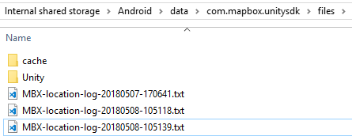
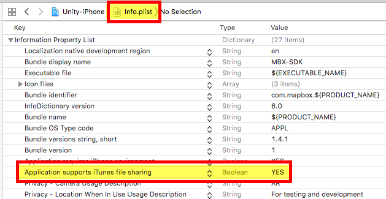
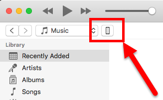
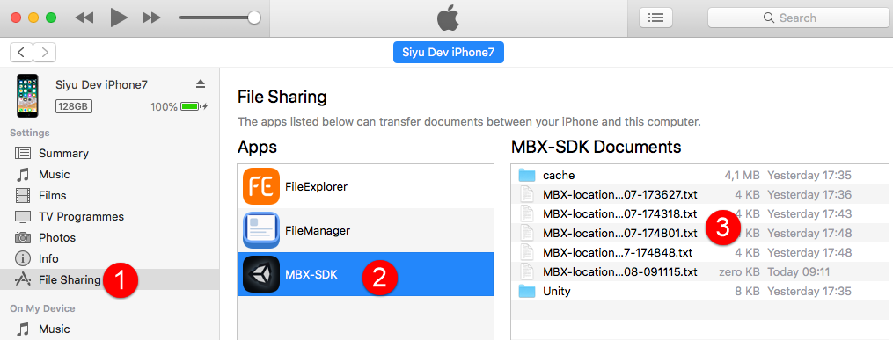

# Accessing GPS log files

`LocationProvider` scene has the option to write location data into files.
Follow these steps download the logs from your device.

## Android

Log files can be accessed directly via Explorer after plugging in the device.

**Note:** If files don't show up disconnect/connect your device. Sometimes even a reboot seems to be required as folders/files only get synced on first connection.

**Alternative:** use a file manager (eg [Solid Explorer Classic](https://play.google.com/store/apps/details?id=pl.solidexplorer)) on your device and copy files to eg `<storage>/Download` that should trigger a refresh.


Location:

```
/<your-device>/<storage>/Android/data/<bundle-identifier>/files/
```



## iOS

Open the exported project in `XCode` and add `Application supports iTunes file sharing : YES` key to `Info.plist` file:



Build to the device, run, log and connect device to your computer.

Select the device in `iTunes`:



1. Click on `File Sharing`
2. Select `Bundle Identifier` eg `MBX-SDK` from the `Apps` list
3. Access log files


