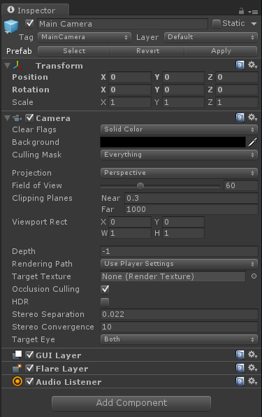

# HoloLens development

-> [!NOTE]
-> Refer to [Exporting to Windows Store (UWP, HoloLens)](windowsstore-uwp-hololens.md) to meet the `sqlite3` requirement for `Windows Store` solutions.

HoloLens requires code/assemblies to work with [Universal Windows Platform (UWP)](https://developer.microsoft.com/en-us/windows/apps).

Reference: [dev.microsoft.com: Unity development overview, Configuring a Unity project for HoloLens](https://developer.microsoft.com/en-us/windows/holographic/unity_development_overview)
  * **`Main Camera`**
    * has to be named **`Main Camera`** 😏
    * `Main Camera` has to be positioned at `0,0,0`
    * set `Clear Flags`  to `Solid Color`
    * change the `Background color` to `RGBA 0,0,0,0`
    * Change `Clipping Planes - Near` to the HoloLens recommended **0.85 (meters)**
      

  * File -> Build Settings -> Windows Store
     * `SDK` => `Universal 10`
     * `Build Type` => `D3D`
     * `Player Settings` => `Settings for Windows Store` tab
       * `Other Settings` => `Rendering`:
         * **!!!check checkbox `Virtual Reality Supported` to add a new `Virtual Reality Devices` list and confirm `Windows Holographic` is listed as supported device!!**
       * `Publish Settings` => `Capabilities`:
         * check `SpatialPerception`
         * **!!!check `InternetClient`!!!**
 
    * Edit -> Project Settings -> Quality
      
      * select dropdown under `Windows Store` logo to `Fastest`
